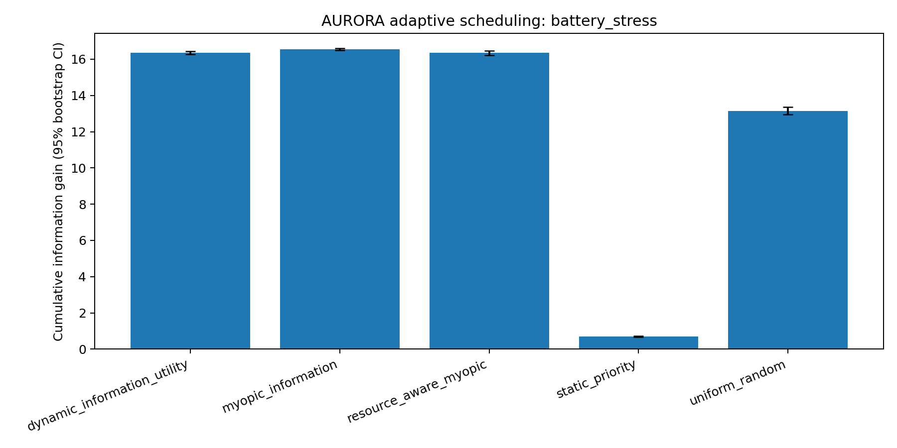
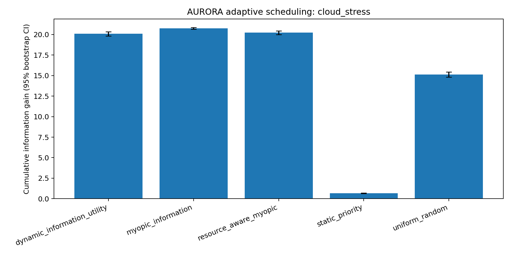
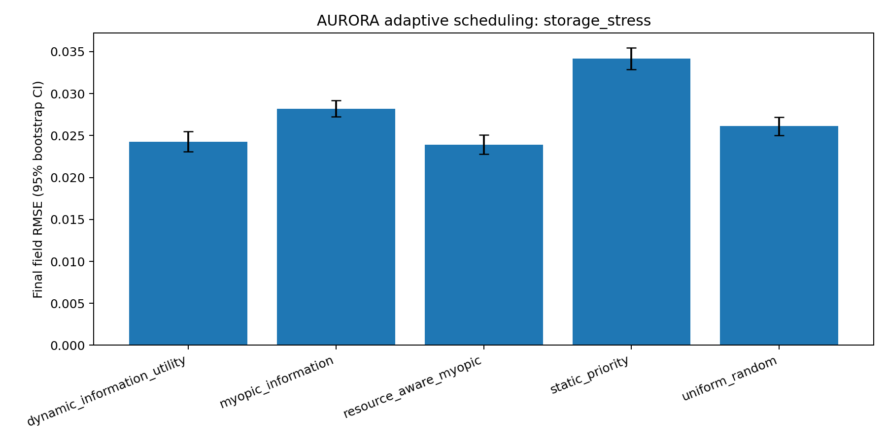
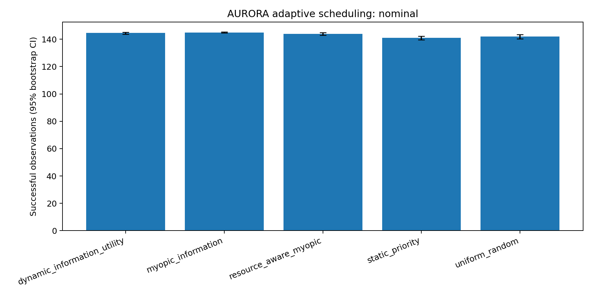

# AURORA-SR

**AURORA-SR is a resource-aware satellite mission scheduler for drought
monitoring.** It simulates how a spacecraft can choose observations when
battery, onboard storage, cloud uncertainty, access windows, and downlink
capacity all compete for limited resources.

This is the public release prepared for Hack Club's Phantom Hackathon. It is a
scoped, reproducible release of the AURORA-SR simulator and its verification
materials, not the entire private research workspace.

## What it does

The simulator compares several observation policies under matched random seeds:

- dynamic information utility (the AURORA-SR policy);
- myopic information;
- resource-aware myopic scheduling;
- static priority; and
- uniform random selection.

It evaluates the policies in nominal, battery-stress, storage-stress, and
cloud-stress scenarios. The scheduler estimates the value of each possible
observation and trades information gain against energy, storage, cloud risk,
and future opportunities. The checked-in report contains the experiment
configuration, aggregate results, paired comparisons, and limitations.

The release also contains an optional remote-training package for reading
small Sentinel-2 windows through the Microsoft Planetary Computer. That
package is separate from the synthetic simulator experiment and is not
required to run the main demo.

## Why I made it

Satellite data can be useful for drought monitoring, but a satellite does not
have unlimited power, storage, or visibility. A useful planner has to decide
which measurement is worth taking now while preserving future options. AURORA
is my attempt to make that decision process explicit, measurable, and
inspectable instead of treating satellite scheduling as a list of fixed
commands.

## How it was made

The main experiment is a deterministic Python simulator with matched-seed
Monte Carlo comparisons. `Physics.py` contains the orbital access, eclipse,
power, cloud, storage, and observation-model utilities. The publication runner
executes the experiment and writes machine-readable outputs. The experiment
uses 24 runs per scenario and records final-field RMSE as its primary metric,
with information gain, MAE, calibration, efficiency, and resource rejections
as secondary metrics.

The included results are synthetic. They show how the policies behave under
the documented assumptions; they are not flight qualification, operational
performance, or proof that the policy will generalize to every satellite or
region.

## Tech stack

- Python 3.10+
- NumPy and SciPy for numerical simulation
- Matplotlib for experiment figures
- PySTAC Client and Planetary Computer for optional Sentinel-2 metadata/window
  access
- Rasterio and PyProj for optional geospatial window handling
- PyTorch for the optional remote-training workflow
- GitHub Actions for release verification

## Screenshots

The checked-in figures show the scheduler's behavior under different resource
constraints:

| Battery stress | Cloud stress |
|---|---|
|  |  |

| Storage stress | Nominal observations |
|---|---|
|  |  |

The full figure set and CSV summaries are in [`results/`](results/).

## Development and installation

Clone the repository and enter the release directory:

```bash
git clone https://github.com/Dhruv-Ranjan/ALLEN_BZ.git
cd ALLEN_BZ/AURORA_SR_RELEASE
```

Create a virtual environment and install the release dependencies:

```bash
python -m venv .venv
```

On macOS/Linux:

```bash
source .venv/bin/activate
```

On Windows PowerShell:

```powershell
.\.venv\Scripts\Activate.ps1
```

Then install dependencies:

```bash
python -m pip install -r requirements-research.txt
```

Run the quick simulator smoke test:

```bash
python aurora_publication_ready.py --quick
```

Run the full experiment:

```bash
python aurora_publication_ready.py
```

Verify the release structure and recorded configuration:

```bash
python verify_release.py
```

Run the offline remote-training tests:

```bash
python -m unittest remote_training.test_remote_training
```

The optional metadata-only smoke test requires network access:

```bash
python -m remote_training.smoke_remote \
  --regions-json remote_training/regions.example.json \
  --max-candidates 5
```

The remote trainer can be used with an existing model factory. See
[`remote_training/README.md`](remote_training/README.md) before attempting a
large run.

## Demo

There is no hosted web demo yet. The quick command above is the reproducible
local demo and completes without downloading the private drought dataset or
model checkpoints. The generated result directory can be inspected alongside
the checked-in figures and CSV summaries.

## What is public, and what is not

This directory intentionally excludes the manuscript, the approximately
1.1 GB cached drought dataset, trained model checkpoints, private databases,
runtime caches, Python bytecode, and the broader application/training tree.
The release `.gitignore` blocks common generated and private artifacts,
including remote raster caches, model files, databases, and checkpoints.
[`PROVENANCE.md`](PROVENANCE.md) records the release scope in more detail.

If you are evaluating this for a patent or other intellectual-property filing,
please treat this public repository as a disclosure and get qualified legal
advice about filing strategy and timing.

## AI disclosure

GitHub Copilot was used for debugging the 100,000-sample remote-training and
pull code, general debugging, and Git commands used to prepare and publish
the repository. The project direction, experiment design, scientific
interpretation, and final decisions about what to release remain mine.

## License and reuse

No license has been added to this release yet. Please ask before redistributing
or incorporating the code into another project.
